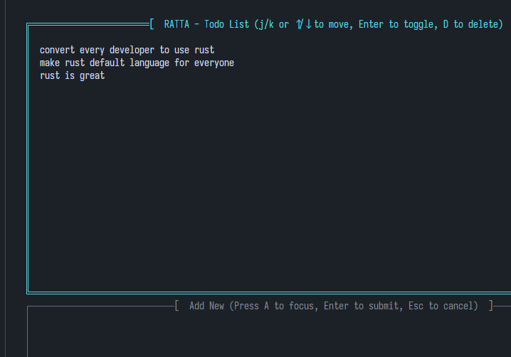

# 🐀 Ratta
A beautiful terminal-based todo list application built with Rust and Ratatui.




## ✨ Features

- **Terminal User Interface**: Clean and intuitive TUI with dual-pane layout
- **Persistent Storage**: Todos are automatically saved to `~/.ratta_todos.json`
- **Keyboard Navigation**: Full keyboard support with both arrow keys and Vim-style keybindings
- **Visual Feedback**: Dynamic border highlighting shows which view is active
- **Task Completion**: Toggle todos between completed/incomplete states
- **Strikethrough Styling**: Completed tasks appear with strikethrough text

## 🚀 Installation

### Prerequisites

- Rust (2024 edition) and Cargo
- A terminal emulator that supports modern terminal features

### Running the Application

1. Download the ZIP file from the releases
2. Extract the archive
3. Navigate to the extracted folder
4. Run:

```bash
cargo run -q
```

### Keyboard Shortcuts

#### List View (Default)

| Key         | Action                                    |
| ----------- | ----------------------------------------- |
| `↑` / `k`   | Move selection up                         |
| `↓` / `j`   | Move selection down                       |
| `Enter`     | Toggle completion status of selected todo |
| `A`         | Switch to Add view to create a new todo   |
| `D`         | Delete the selected todo                  |
| `q` / `Esc` | Quit the application                      |

#### Add View

| Key                | Action                                   |
| ------------------ | ---------------------------------------- |
| Type any character | Add to todo text                         |
| `Backspace`        | Delete last character                    |
| `Enter`            | Save the new todo and return to list     |
| `Esc`              | Cancel and return to list without saving |

## 🏗️ Architecture

### Core Components

- **AppState**: Main application state holding todos, list selection, focused view, and input value
- **TodoItem**: Data structure for individual todos with title and completion status
- **FocusedView**: Enum tracking which view (List or Add) currently has focus
- **FormActions**: Enum for handling form submission/cancellation

### File Structure

```
ratta/
├── src/
│   └── main.rs          # Main application code
├── Cargo.toml           # Project dependencies and metadata
└── README.md           # This file
```

### Data Persistence

Todos are automatically saved to `~/.ratta_todos.json` in JSON format:

```json
[
  {
    "title": "Complete the project",
    "completed": false
  },
  {
    "title": "Write documentation",
    "completed": true
  }
]
```

## 📦 Dependencies

- **[ratatui](https://github.com/ratatui-org/ratatui)** (v0.30.\*): Terminal UI framework
  - `all-widgets` feature enabled for full widget support
- **[color-eyre](https://github.com/eyre-rs/color-eyre)** (v0.6.5): Enhanced error reporting with colored backtraces
- **[serde](https://serde.rs/)** (v1.0): Serialization framework
  - `derive` feature for automatic trait implementation
- **[serde_json](https://github.com/serde-rs/json)** (v1.0): JSON serialization
- **[dirs](https://github.com/srossross/dirs-rs)** (v5.0): Platform-specific directory paths

## 🎨 UI Layout

The application features a split-pane layout:

```
┌────────────────────────────────────────────────┐
│  RATTA - Todo List (Navigation shortcuts)     │
│                                                │
│  -> Buy groceries                             │
│     Write documentation (strikethrough)        │
│     Call mom                                   │
│                                                │
│                                                │
└────────────────────────────────────────────────┘
┌────────────────────────────────────────────────┐
│  Add New (Press A to focus, Enter to submit)  │
│                                                │
│  [Your input appears here]                     │
│                                                │
└────────────────────────────────────────────────┘
```

- **Top Pane**: Todo list with selection highlighting (cyan border when focused)
- **Bottom Pane**: Add new todo input field (green border when focused)

## 🔧 Technical Details

### Event Loop

The application runs on a simple event loop:

1. **Render**: Draw the current UI state to the terminal
2. **Handle Input**: Process keyboard events and update state
3. **Repeat**: Continue until user quits

### State Management

- **ListState**: Ratatui's stateful widget state for tracking list selection
- **FocusedView**: Controls which view receives keyboard input
- **Input Buffer**: Temporary storage for text being typed in Add view

### Error Handling

Uses `color-eyre` for beautiful error messages with full context and suggestions. All fallible operations return `Result<T>` for proper error propagation.

## 🛠️ Development

### Running in Debug Mode

```bash
cargo run
```

### Building for Release

```bash
cargo build --release
./target/release/ratta
```

### Code Style

The codebase includes extensive inline comments explaining:

- Function purposes and parameters
- Ratatui concepts and patterns
- State management logic
- Keyboard event handling

## 🐛 Known Limitations

- No support for multi-line todo items
- No categories or tags
- No due dates or priorities
- No search functionality
- Terminal must support UTF-8 and modern terminal features

## 🔮 Future Plans

We have exciting plans to enhance Ratta with:

### Dashboard & Analytics
- **Progress Graphs**: Visual charts showing completed vs remaining tasks
- **Statistics Pane**: Display completion rate, total tasks, and daily/weekly progress
- **Charts Integration**: ASCII-based bar and line charts for terminal compatibility

### Enhanced Features
- **Better Preview**: Detailed task preview with metadata (creation date, completion date, estimated time)
- **Task Filtering**: Filter by status, completion date, or search keywords
- **Statistics Dashboard**: Overview of productivity metrics and trends
- **Color Themes**: Customizable color schemes for personalization
- **Performance Metrics**: Track how many tasks you complete per day/week

### Improvements
- Add todo editing capabilities
- Implement categories/tags for organization
- Add priority levels and sorting
- Support for todo reordering (drag & drop)
- Export/import functionality (CSV, JSON formats)
- Recurring tasks support
- Dark and light theme options

## 🤝 Contributing

Contributions are welcome! We're actively looking for developers interested in the areas listed above.

## 📝 License

This project is available under the MIT License.

## 🙏 Acknowledgments

- Built with [Ratatui](https://github.com/ratatui-org/ratatui) - a Rust terminal UI library
- Inspired by terminal-based productivity tools

---

Made with 🦀 and Rust and ❤️ from RadiumCoders
